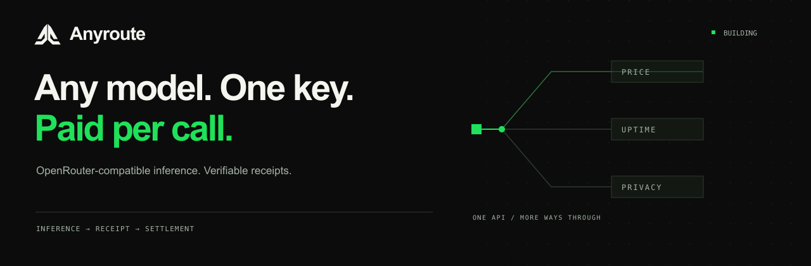
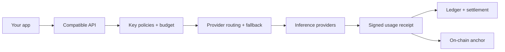
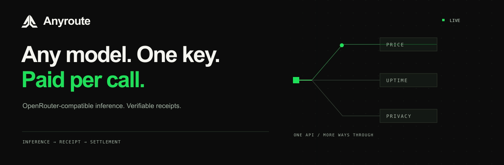

<p align="center">
  
</p>

<p align="center">
  <a href="https://github.com/AnyRouteRH/AnyRoute/actions/workflows/release-checks.yml"></a>
  <a href="https://github.com/AnyRouteRH/AnyRoute/actions/workflows/publish-guard.yml"></a>
  <a href="LICENSE"></a>
  
</p>

<p align="center">
  <a href="#run-it-locally">Run locally</a> ·
  <a href="web/public/openapi.json">API specification</a> ·
  <a href="CONTRIBUTING.md">Contribute</a> ·
  <a href="https://x.com/TryAnyroute">Follow @TryAnyroute</a>
</p>

# Anyroute

**One interface for inference, payments and receipts.** Anyroute routes OpenRouter-compatible requests across providers, with USDG settlement on Robinhood Chain and a signed receipt for each generation.

Choose a model. Set your routing policy. Inspect what happened.

> **Pre-launch:** local demos use test funds and mock providers. Production readiness is still under review.

## What you can build with it

| Capability | What it gives you |
| :--- | :--- |
| **One API, multiple providers** | Chat, streaming, completions and embeddings with provider selection and fallback. |
| **Spend controls** | Virtual keys, budgets, rate limits, model restrictions and key-enforced guardrails. |
| **Flexible payments** | Prepaid USDG, per-call HTTP 402 payments and Stock Token payment sessions. |
| **Verifiable usage** | Signed generation receipts, public verification and on-chain receipt anchors. |
| **Provider accountability** | Operator-reviewed onboarding, health probes, canaries and attestation checks. |
| **A complete workspace** | Model catalog, API docs, playground and wallet-aware dashboard. |

## Run it locally

Use **Bun 1.3+**, **Node 22+**, **pnpm** and **Foundry** (`anvil`, `forge`).

```bash
git clone https://github.com/AnyRouteRH/AnyRoute.git
cd AnyRoute
bun install
bun run launch
```

The launcher starts the local chain, contracts, mock providers, API and website. Open the printed URL, create a key, add test USDG and try the Playground. Ctrl-C stops the demo; its state stays in the ignored `.data/` directory.

## Bring your existing client

Point an OpenAI-compatible client at your router and use an Anyroute key:

```ts
import OpenAI from "openai";

const client = new OpenAI({
  baseURL: process.env.ANYROUTE_BASE_URL, // e.g. http://127.0.0.1:8787/api/v1
  apiKey: process.env.ANYROUTE_API_KEY,
});

const result = await client.chat.completions.create({
  model: "meta-llama/llama-3.3-70b-instruct",
  messages: [{ role: "user", content: "Hello, Anyroute." }],
});
```

[OpenAPI specification →](web/public/openapi.json)

## Inside the router



| Area | Source |
| :--- | :--- |
| API and routing | [`src/api`](src/api) · [`src/router`](src/router) |
| Ledger and payments | [`src/ledger`](src/ledger) · [`src/pay`](src/pay) |
| Receipts and workers | [`src/receipts`](src/receipts) · [`src/services`](src/services) |
| Smart contracts | [`contracts/src`](contracts/src) |
| Website and dashboard | [`web`](web) |

## Build with us

[Report a bug](https://github.com/AnyRouteRH/AnyRoute/issues/new?template=bug.yml), [suggest an improvement](https://github.com/AnyRouteRH/AnyRoute/issues/new?template=feature.yml), or read the [contribution guide](CONTRIBUTING.md). Security findings belong in [private vulnerability reports](SECURITY.md).

## Support

Questions or problems with the service or a deposit: Anyroute1@atomicmail.io. Security issues: see [SECURITY.md](SECURITY.md).

## License

Anyroute is **source-available under [PolyForm Noncommercial 1.0.0](LICENSE)**, except for files with their own license notices. Commercial use outside the license's permitted purposes requires separate written permission. [Request commercial licensing →](https://github.com/AnyRouteRH/AnyRoute/issues/new?template=licensing.yml)

Existing MIT-licensed contracts and third-party licenses remain in effect; see [NOTICE](NOTICE). This is a non-commercial software license, not an OSI-approved open-source license.

<details>
<summary>Prefer a still header?</summary>



</details>
