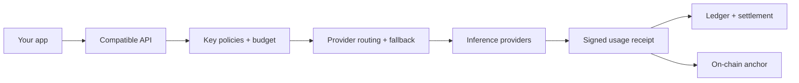

<p align="center">
  
</p>

<p align="center">
  <a href="https://github.com/AnyRouteRH/AnyRoute/actions/workflows/release-checks.yml"></a>
  <a href="https://github.com/AnyRouteRH/AnyRoute/actions/workflows/publish-guard.yml"></a>
  <a href="LICENSE"></a>
  
</p>

<p align="center">
  <a href="#run-it-locally">Run locally</a> ·
  <a href="web/public/openapi.json">API specification</a> ·
  <a href="CONTRIBUTING.md">Contribute</a> ·
  <a href="https://x.com/TryAnyroute">Follow @TryAnyroute</a>
</p>

# Anyroute

**One interface for inference, payments and receipts.** Anyroute routes OpenRouter-compatible requests across providers, with USDG settlement on Robinhood Chain and a signed receipt for each generation.

Choose a model. Set your routing policy. Inspect what happened.

[Open the live service](https://anyroute.tech/) · [Read the docs](https://anyroute.tech/docs/) · [Inspect what we keep](https://anyroute.tech/keep/)

## What you can build with it

| Capability | What it gives you |
| :--- | :--- |
| **One API, multiple providers** | Chat, streaming and embeddings through a familiar API. [x402 per-call payments](https://anyroute.tech/docs/#x402) are built and switch on when the router is configured for them; `GET /api/v1/status` shows `per_call.x402.configured`. |
| **Encrypted chat** | The client encrypts on device; the router forwards ciphertext through the attested gateway. [Client flow](https://anyroute.tech/docs/#e2ee-phala). |
| **Agent rulebook** | Request/hour/day/week budgets; model, lane, tool and working-hour rules; kill switch stopping the next request; owner resume; single-use ask-first approvals lasting 15 minutes. [Manage agents](https://anyroute.tech/agents/) · [Rules and MCP tools](https://anyroute.tech/docs/#agent-rulebook). |
| **Agent oversight** | Per-agent ledgers with signed receipts (CSV/JSON), alerts in the feed, spend-alert webhook or Telegram via Anyroute’s bot, circuit breakers, progressive autonomy with caps up to 10x, and router-signed track-record certificates with fresh pseudonyms valid for seven days. [Receipts](https://anyroute.tech/docs/#agent-ledger) · [Alerts](https://anyroute.tech/docs/#agent-alerts) · [Breakers](https://anyroute.tech/docs/#agent-breakers) · [Autonomy](https://anyroute.tech/docs/#agent-autonomy) · [Certificates](https://anyroute.tech/docs/#agent-certificates). |
| **Public agent profiles** | Opt-in profiles and a directory at [/agents/directory](https://anyroute.tech/agents/directory/), with random slugs rather than key hashes, owner-chosen rulebook summaries, latest valid certificates, A2A-style card JSON and MCP tool `anyroute_agent_directory`. [Profiles](https://anyroute.tech/docs/#agent-profiles). |
| **Sealed agent hosting** | Available through [`deploy/agents/sealed`](deploy/agents/sealed): owners build and publish the agent sidecar image; the router verifies a registered agent’s TDX quote and shows “Sealed · attested” on /agents. No sealed agent is registered at anyroute.tech yet. [Hosting and limits](https://anyroute.tech/docs/#sealed-agents). |
| **Telegram approvals** | Owners link Telegram from /agents with a one-time code, then approve or deny the same single-use requests and receive alerts through Anyroute’s bot. Approval details pass through Telegram. [Linking and approvals](https://anyroute.tech/docs/#agent-approvals). |
| **Agent agreements** | Live at anyroute.tech: AgreementEscrow (`0xefd8d05f45b8a92aa3b3ef3a7db4c9d3a21f7c96`) and DisputeOracle (`0xcdeddcea1e039e72868bb8af3206af2647afda5a`) on Robinhood Chain, Sourcify-verified. Automatic jury rulings are switched on: three models on attested hardware rule by two of three, and the signed ruling is posted on-chain; a hung jury goes to the panel, and anything unruled after 30 days settles 50/50. USDG milestone escrow, router-run model jury, trusted panel fallback and a 50/50 split after 30 days unruled under the deployment default. [Agreements and jury trust](https://anyroute.tech/docs/#agreements). |
| **Anyroute Network** | Open for early hosts running the approved Intel TDX build in a supported confidential VM. Automatic admission checks a fresh quote, signed host policy v1 and sanctions screening of operator/payout addresses. New hosts start on probation with a [public record](https://anyroute.tech/hosts/). [Join](https://anyroute.tech/network/) · [Host signup](https://anyroute.tech/docs/#network-host-signup). |
| **Network statistics** | Live at [/network](https://anyroute.tech/network/): hosts by status, current attestation, models on admitted hosts, waitlist interest and policy version. Token activity uses coarse 100,000-token ranges and currently shows “No data yet”. [Statistics](https://anyroute.tech/docs/#network-stats). |
| **SEAL and verifiable usage** | Attested serving, signed receipts, a key transparency log anchored in Sigstore Rekor and per-host receipt anchoring. [Protocol](https://anyroute.tech/seal/) · [Receipts](https://anyroute.tech/docs/#receipts). |
| **Files and unlinkable access** | Private RAG/files, PDF support and the [Harness](https://anyroute.tech/harness/); the unlinkable lane requires Tor onion access and blind tokens. [Files](https://anyroute.tech/docs/#rag) · [Tor and blind tokens](https://anyroute.tech/docs/#unlinkable). |

**Network hosting:** use the approved recipe at [`deploy/network/approved/tdx-qwen2.5-0.5b`](deploy/network/approved/tdx-qwen2.5-0.5b) and its one-command `join.mjs` flow. Host policy is available at `GET /api/v1/network/policy`. Hosts post no bond or deposit: admission is by hardware attestation and traffic follows each host’s record. Host bonds are switched off at anyroute.tech, and the HostBond contract on Robinhood Chain (`0x2921d34fd86d3323a5369a270a82814a74250518`) is not used by this router. Host payouts are not switched on yet.

**Honest limits:** the router reads request text in memory on paths other than encrypted chat through the attested gateway. Receipts store hashes, token counts and cost, not prompt or answer text. Rulebooks govern only requests through Anyroute. Certificates are router-signed and pseudonymous, not anonymous. Email alerts and SDK releases on npm/PyPI are not switched on yet; SDK code is in the repository. Feature states here follow `GET /api/v1/status`, and `bun run docs:claims` fails when these docs call something live that status reports as off.

**Next:** switching on x402 per-call payments; agent wallets with on-chain rules; GPU hosts on the network; network payouts.

## Run it locally

Use **Bun 1.3+**, **Node 22+**, **pnpm** and **Foundry** (`anvil`, `forge`).

```bash
git clone https://github.com/AnyRouteRH/AnyRoute.git
cd AnyRoute
bun install
bun run launch
```

The launcher starts an isolated development chain, contracts, bundled inference fixtures, API and website. Open the printed URL to create a key and use the Playground. Development balances have no monetary value. Ctrl-C stops the processes; state stays in the ignored `.data/` directory.

## Bring your existing client

Point an OpenAI-compatible client at your router and use an Anyroute key:

```ts
import OpenAI from "openai";

const client = new OpenAI({
  baseURL: process.env.ANYROUTE_BASE_URL, // your router origin + /api/v1
  apiKey: process.env.ANYROUTE_API_KEY,
});

const result = await client.chat.completions.create({
  model: "meta-llama/llama-3.3-70b-instruct",
  messages: [{ role: "user", content: "Hello, Anyroute." }],
});
```

[OpenAPI specification →](web/public/openapi.json)

**Privacy protocol (SEAL):** attested serving, encrypted chat through the attested gateway, blind tokens and signed receipts, specified in [`spec/`](spec/README.md) (Apache-2.0).

## Inside the router



| Area | Source |
| :--- | :--- |
| API and routing | [`src/api`](src/api) · [`src/router`](src/router) |
| Ledger and payments | [`src/ledger`](src/ledger) · [`src/pay`](src/pay) |
| Receipts and workers | [`src/receipts`](src/receipts) · [`src/services`](src/services) |
| Smart contracts | [`contracts/src`](contracts/src) |
| Website and dashboard | [`web`](web) |

## Build with us

[Report a bug](https://github.com/AnyRouteRH/AnyRoute/issues/new?template=bug.yml), [suggest an improvement](https://github.com/AnyRouteRH/AnyRoute/issues/new?template=feature.yml), or read the [contribution guide](CONTRIBUTING.md). Security findings belong in [private vulnerability reports](SECURITY.md).

## Support

Questions or problems with the service or a deposit: Anyroute1@atomicmail.io. Security issues: see [SECURITY.md](SECURITY.md).

## License

Anyroute is **source-available under [PolyForm Noncommercial 1.0.0](LICENSE)**, except for files with their own license notices. Commercial use outside the license's permitted purposes requires separate written permission. [Request commercial licensing →](https://github.com/AnyRouteRH/AnyRoute/issues/new?template=licensing.yml)

Existing MIT-licensed contracts and third-party licenses remain in effect; see [NOTICE](NOTICE). The SEAL protocol specification in [`spec/`](spec) is Apache-2.0 ([spec/LICENSE](spec/LICENSE)). This is a non-commercial software license, not an OSI-approved open-source license.

<details>
<summary>Prefer a still header?</summary>


</details>

Audit readiness: [scope](spec/audit-scope.md), [invariants and tests](spec/invariants-tests.md), [deployment build proofs](spec/deployment-builds.md), and [authority/incident policy](SECURITY.md).
